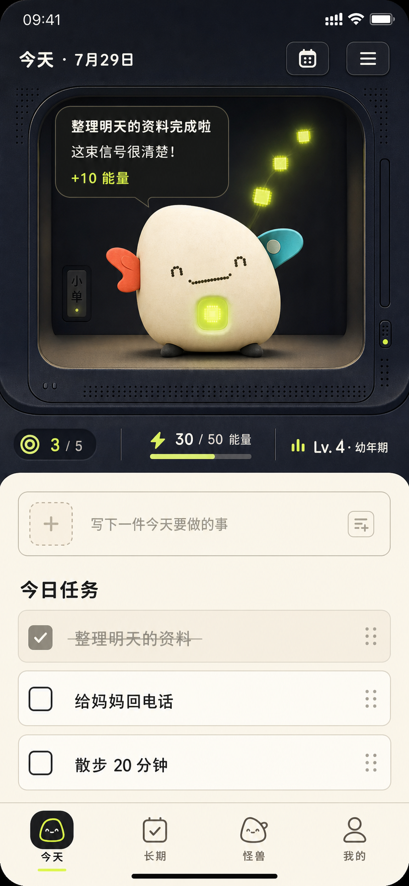
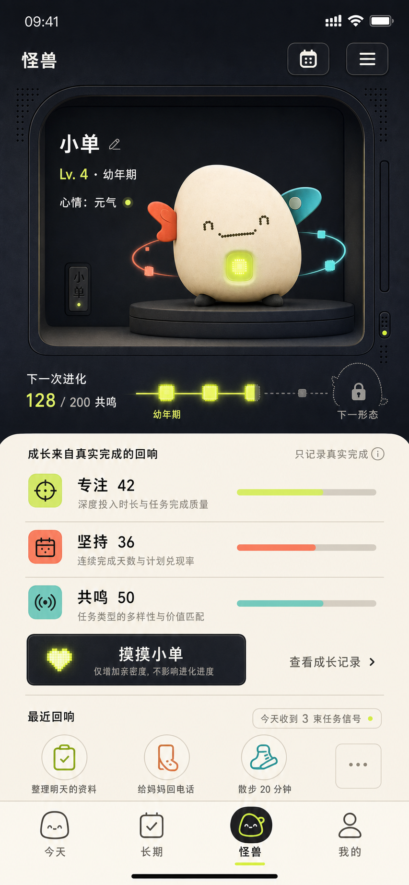
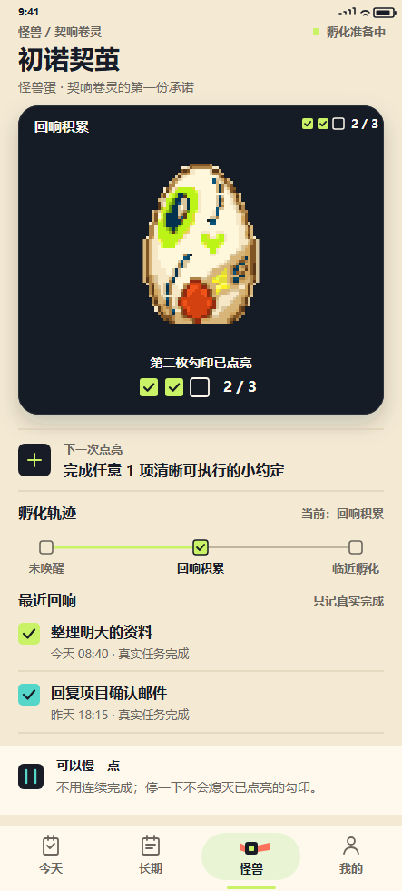
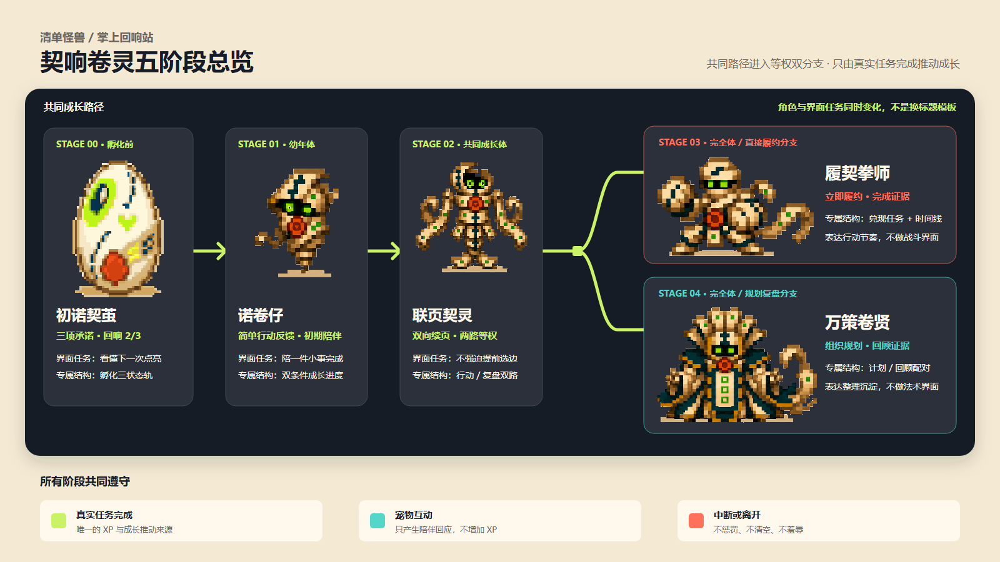

# 清单怪兽 — 设计文档

> 本文是 L1 设计事实源。用户已确认“掌上回响站”整体观感用于独立 Craft 工作区的组件化原型实现；该确认不授权删除、隐藏或覆盖任何既有文档、画板、按钮、素材、产品功能或 Craft 编辑器能力，也不等同于生产视觉终稿。

## 0. 文档定位

### 0.1 本轮目标

把清单怪兽从“普通清单 App 附加养成卡片”重构为“原创电子宠物的日常陪伴产品，清单完成是培养方式”，同时守住四条业务底线：

1. 正式成长只来自真实任务完成。
2. 不因断签、未完成、离开或撤销而惩罚、羞辱或制造怪兽负面状态。
3. 完成反馈本地优先，不被同步和网络阻塞。
4. XP 账本与阶段状态仍以现有契约为唯一事实源。

### 0.2 状态与门禁

| 项 | 当前结论 |
| --- | --- |
| 设计门控 | L1 完整设计 |
| 文档状态 | `confirmed_for_craft_prototype` |
| 确认方向 | A「掌上回响站」 |
| Image 2 视觉门禁 | 已生成 2 张判断稿；用户确认整体观感进入 Craft 原型 |
| Craft 原型门禁 | 通过；必须使用独立工作区“清单怪兽·回响站” |
| 生产实现门禁 | 未通过；仍需真实组件截图与业务验收 |
| QA 证据 | 无；Image 2 不作为 QA 证据 |

### 0.3 事实源

- `docs/pm/list-monster-mvp-prd.md`
- `docs/pm/current-software-status.md`
- `docs/pm/craft-list-monster-coverage-audit.md`
- `docs/contracts/domain-model.md`
- `docs/contracts/events.md`
- `docs/contracts/xp-rules.md`
- `docs/contracts/assets.md`
- `docs/pm/current-app-preview*.png`
- `C:\Users\Administrator\Documents\craft-demo\output\playwright\list-monster-*.png`（只读参考）
- `apps/list_monster_app/lib/main.dart`、`packages/ui_kit/lib/ui_kit.dart`、`packages/sprite_runtime/lib/sprite_runtime.dart`（只读现状核对）

### 0.4 迭代历史摘要

#### v0.6 — 2026-08-05（T-DIGIPET-007A-R2）

- 按用户最新反馈新增非覆盖式 `stage-00-egg-r2.png`，主舱移除横向／纵向光晕、观察窗、额外落地影、横线和装饰性像素星点，不增加替代装饰。
- 从最终蛋状态资产确定性透明裁切出 480×660 蛋主体，排除素材自带地面像素；252,864 个非透明像素与源坐标一致。
- 蛋主体按 128×176 等比显示，源与显示宽高比均为 `0.727273`，差异 `0.000%`。
- 已确认的身份、承诺 2/3、点亮条件、孵化轨迹、两条回响及无压力说明保持不变；R2 取代 R1 成为后续 Craft 实现基线。

#### v0.5 — 2026-08-05（T-DIGIPET-007A-R1）

- 响应用户对旧蛋页“纵向拉长”的观感反馈，新增非覆盖式 `stage-00-egg-r1.png`，旧 `stage-00-egg.*` 保留为历史记录。
- R1 改用最终蛋资产的 480×720 透明有效像素裁切，按 124×186 等比显示；源与显示宽高比均为 `0.666667`，差异 `0.000%`。
- 蛋体较旧稿有效显示高度减少 12px（约 6.1%），并以 218×152 的短宽光晕和横向落地影稳定主舱重心；没有通过非等比压缩改变角色形状。
- 原有身份、承诺 2/3、点亮条件、三阶段轨迹、两条回响和无压力说明全部保留；R1 取代旧蛋页成为后续 Craft 实现基线。
- 总览已使用 146×219 等比透明裁切，且未复用旧蛋页纵向观察窗，因此不重复导出；比例证据归档于 `stage-overview-r1-audit.source.md`。

#### v0.4 — 2026-08-05（T-DIGIPET-007B）

- 基于已通过 QA 的初诺契茧页面，完成诺卷仔、联页契灵、履契拳师、万策卷贤四张 443×980 独立高保真稿和一张 1600×900 五阶段总览。
- 四页共享深墨主舱、暖纸任务区、青柠完成信号、珊瑚契约信号和四项底部导航，但分别采用“当前小任务与双条件进度”“等权双路”“兑现时间线”“计划/回顾配对”结构。
- 四角色均从最终 `checklist-creature-pixel-evolution-v3-r3.png` 确定性裁切；只透明化背景、清理分支箭头与背景噪点，不重画、不改形、不使用旧“小单”或生成式变体。
- 为四页和总览归档 SVG、来源说明与 meta，并记录裁切坐标、原图/派生/输出哈希、导出尺寸和 375px／200% 大字风险。
- 分支编号冻结为 `stage-03` 履契拳师与 `stage-04` 万策卷贤；共同路径仍为 `stage-00 → stage-01 → stage-02` 后等权分支。
- 本任务未修改 Craft、Flutter、业务契约或任何原宠物资产。

#### v0.3 — 2026-08-05（T-DIGIPET-007A）

- 将当前角色事实源切换为“契响卷灵”五形态：初诺契茧、诺卷仔、联页契灵、履契拳师、万策卷贤。
- v0.1-v0.2 的原创“小单”角色与相关界面说明仅保留为历史设计记录，不再作为后续实现角色基线。
- 建立五形态共享怪兽页骨架，固定身份、角色主舱、下一变化、形态专属轨、最近回响、无压力说明与四项导航的关系；各形态必须具有不同的信息任务，禁止只换标题和图片。
- 交付 443×980 的初诺契茧 `stage-00-egg.png`：使用最终像素蛋资产的“回响积累 2/3”状态，所有中文后期确定性排版。
- 冻结蛋页规则：三个明确可执行承诺依次点亮；第三个真实任务完成才进入临近孵化；蛋页不出现抚摸、幼年体、饥饿、货币、战斗、惩罚或羞辱。
- 本任务只交付设计与视觉归档，未修改 Craft 或启动实现。

#### v0.2 — 2026-07-29（T-DIGIPET-003A）

- 用户确认“掌上回响站”整体观感，进入独立 Craft 工作区的组件化原型实现。
- 冻结 15 个画板的完整覆盖范围：5 个页面、2 个弹层、5 个桌宠状态、3 个 Widget 尺寸。
- 冻结 Craft 编辑器能力非回归范围：组件、图层、拖拽、属性、撤销重做、画板管理、视口导航、AI JSON 导出。
- “专注 / 坚持 / 共鸣”保留为 v0.1 视觉实验记录，不作为 PRD 指标；原型统一使用 XP、等级、阶段、连续天数。
- 旧版 Craft 工作区只读保留；新版本使用独立工作区“清单怪兽·回响站”，不得覆盖旧版。

#### v0.1-draft — 2026-07-29（T-DIGIPET-001）

- 完成 L1 审计、三种美学探索、三层 Token、交互闭环与两张 Image 2 判断稿。
- 推荐“掌上回响站”，当时状态为待用户确认。
- 本节保留原始审计和探索轨迹；v0.2 不回写或抹除当时结论。

---

## 1. 产品与世界观定位

### 1.1 一句话体验

清单怪兽是一台住在手机与桌面上的“掌上回响站”：用户每完成一件真实任务，就向原创回响兽“小单”发送一束可见信号；信号成为投喂、训练与共鸣的表现，最终推动同一套 XP 与阶段成长。

### 1.2 原创世界观

- **回响兽**：从人做出的真实承诺与完成行为中学习节奏的电子生命，不以饥饿或惩罚索取注意力。
- **回响站**：小单生活的数字栖息舱，也是 App 的视觉主场；今日页看“此刻互动”，怪兽页看“长期变化”。
- **任务信号**：任务完成后的可视化反馈载体。它不是货币，也不新增账本。
- **回响核**：小单胸口的方形发光核心，作为品牌识别点和 XP/阶段反馈锚点。
- **陪伴关系**：用户帮助小单理解世界，小单把抽象完成记录变成可见、可记住的成长。

### 1.3 历史角色“小单”（v0.1-v0.2，仅存档）

> v0.3 起，本节只保存“掌上回响站”早期角色探索与 Craft 原型来路，不再指导新角色实现。后续界面和资产接入统一以 §17“契响卷灵五形态界面基线”为准；不得从本节继续新增“小单”形态、文案或占位资产。

**固定识别结构**

1. 非对称暖象牙色卵石/种子身体，不采用标准蛋形。
2. 左侧短珊瑚信号鳍、右侧青色折页耳，形成一眼可辨的非对称轮廓。
3. 胸口是方形青柠色“回响核”，禁止使用圆形宝石或胸徽。
4. 表情由短横点阵组成，避免动漫大眼、兽耳脸谱、恐龙/龙类角爪。
5. 两只极小的炭黑脚承担重心，不增加人形手臂与装备系统。

**阶段变化原则**

| 阶段 | 变化重点 | 不变基因 |
| --- | --- | --- |
| 怪兽蛋 | 不规则信号种壳，方形核心只透出一道缝光 | 非对称轮廓、方形核心 |
| 幼年 | 当前视觉稿的小单；身体短而稳，信号鳍短 | 珊瑚左鳍、青色右耳、点阵脸 |
| 少年 | 身体略拉高，左右信号构件开始形成轨迹 | 不增加武器、角、翅膀或服装 |
| 成年 | 核心与信号构件更稳定、轮廓更沉着 | 仍是同一物种，不转为战斗角色 |

`soft / cool / neutral` 风格线只改变表面材质、信号颜色比例和表情节奏，不改变物种骨架，以免形成三套不一致 IP。

### 1.4 成长叙事与既有规则的映射

| 用户行为 | 陪伴叙事 | 现有数据/动作映射 | 规则边界 |
| --- | --- | --- | --- |
| 普通任务完成 | 投喂一束日常信号 | `task_completed` → XP；动作优先 `eat` | 不新增食物、饥饿值或货币 |
| 高优先级任务完成 | 完成一次训练 | 仍按现有高优先级 XP；视觉暂用 `happy_02` | “训练”只是一段反馈，不新增属性 |
| 长期拆解任务完成 | 与长期目标发生共鸣 | `long_term_child`；视觉暂用 `task_milestone` | 不改变 +50 达成规则 |
| 抚摸 | 增加亲密感、触发回应 | `pet_01` / `pet_02` | 明示“不会增加 XP/进化进度” |
| 撤销完成 | 静默校正信号与进度 | `xp_reverted` | 不播放失落、倒退或降级动画 |

优先级冲突时，视觉反馈建议按“长期拆解共鸣 > 高优先级训练 > 普通投喂”取一个主表现；XP 仍完全按现有矩阵计算。此映射是**待 PM 确认的表现层决策**，不是新业务规则。

### 1.5 时间维度

| 时间尺度 | 用户首先感受到什么 | 设计承诺 |
| --- | --- | --- |
| 前 5 秒 | “这里住着我的小单，它正在回应我” | 栖息舱占首屏 38%-46%，角色和当前反馈先于表单 |
| 5 分钟 | 快速写任务、勾选、撤销、继续做事 | 今日任务始终紧邻栖息舱；单手可达；选项渐进展开 |
| 长期陪伴 | 小单的阶段、回忆、节奏因真实完成持续变化 | 怪兽页展示进化轨迹和近期回响，不以断签惩罚维系关系 |

---

## 2. L1 现状设计审计

### 2.1 为什么当前界面像普通清单 App

我注意到现有真实界面与 Craft 复现采用相同骨架：Material 默认排版、白/灰背景、薄荷绿矩形、Chip、表单与底部导航。怪兽区域仍是 `MonsterSpritePlaceholder` 的 180px 绿色卡片，内容由蛋形描边图标和“状态/动作”文本承担。结果是用户先识别出“清单控件”，再发现“这里还有一只怪兽”。

### 2.2 高影响发现

| # | 发现 | 影响 | 证据与后果 |
| --- | --- | --- | --- |
| 1 | 怪兽不是首屏主角，只是与表单同级的状态卡 | 高 | 今日页和怪兽页都复用 180px 占位容器；情感锚点弱 |
| 2 | 蛋形线框明确传达“资源尚未完成” | 高 | 用户看到的是开发占位，不是可建立关系的角色 |
| 3 | 白底、薄荷绿卡与默认 Material 控件构成泛用工具气质 | 高 | 与健康、记账、日程类模板难区分，品牌记忆低 |
| 4 | XP、阶段、心情、完成数被拆为平权 Chip | 高 | 成长因果变成仪表数据，缺少“任务影响小单”的连续感 |
| 5 | App 标题、页面标题、副标题连续占用首屏 | 中 | 前 5 秒先读层级文字，主角进一步下沉 |
| 6 | 新任务的高优先级、提醒、重复选项始终展开 | 中 | 高频的“写下并加入”被低频设置包围，5 分钟效率下降 |
| 7 | 完成后的文字/卡片反馈与怪兽身体没有空间联系 | 高 | 用户知道获得 XP，却看不到能量如何抵达宠物 |
| 8 | 怪兽页只复述阶段、等级、XP 与抚摸按钮 | 高 | 缺少下一次变化、过去共同经历和长期期待 |
| 9 | 颜色同时承担品牌、选中、成功与容器背景 | 中 | 薄荷色失去语义区分；非颜色线索也偏弱 |
| 10 | App、桌宠、Widget 缺少同一“栖息舱”视觉容器 | 中 | 多端虽共享快照，但感知上像三个独立产品表面 |

### 2.3 快速胜利

1. 用一张原创小单静态帧替换蛋形占位，先建立角色识别。
2. 将阶段/心情/完成数/XP Chip 收束为一条“完成进度 + XP + 阶段”状态轨。
3. 任务完成时让 3 个信号像素从任务行飞向回响核；低动效模式改为核脉冲一次。
4. 将高优先级、提醒、重复收进“更多设置”，默认只保留快速输入和“加入今日”。
5. 在今日页让栖息舱与任务区使用深墨/暖纸两块明显不同的表面，停止整页白底+薄荷卡。

### 2.4 竞品设计观察

- [Finch](https://help.finchcare.com/hc/en-us/articles/37780000231309-Exploring-the-Finch-Home-Page)：把每日目标直接连接到宠物能量与冒险，主角存在感强；风险是功能与货币层过多。
- [Habitica](https://habitica.com/static/features?mobile-app=true&theme=dark)：任务奖励与 RPG 解锁关系清晰；风险是惩罚、装备和复杂游戏系统压过日常工具。
- [Forest](https://www.forestapp.cc/en/)：把一次次真实专注沉淀为长期可见的森林；风险是“失败导致枯萎”与清单怪兽的无压力原则冲突。
- [Widgetable](https://widgetable.net/pet)：宠物占据桌面小组件的陪伴场域；值得借鉴的是跨场域持续可见，不是角色或具体视觉。

**差异化机会**：以“单只原创回响兽 + 多端同一栖息舱 + 完成信号可见 + 不惩罚”为核心，减少货币、装备、社交与战斗，把日常完成本身做成值得期待的事件。

---

## 3. 美学方向探索

### 3.1 A — 掌上回响站（推荐）

| 维度 | 定义 |
| --- | --- |
| Mood | 像一台住着真实电子生命的现代掌上设备：沉着、触感明确、有一点神秘，但任务区仍温暖轻松 |
| 关键词 | 哑光仪器、点阵微光、非对称伙伴、暖纸任务台、信号轨迹 |
| 代表配色 | 墨舱 `#171C26`、暖燕麦 `#F4EAD4`、电荷青柠 `#C9F266`、信号珊瑚 `#FF715B`、回声青 `#54D6C8` |
| 字体 | 标题：得意黑/Smiley Sans；正文：思源黑体 SC；数字：同正文开启等宽数字 |
| 适用场景 | 今日主场、怪兽/进化、桌宠、Widget；最适合建立新品类识别 |
| 风险 | 暗色栖息舱过高会压缩任务区；设备感过强会滑向复古玩具或硬核游戏 |

**推荐原因**：它用一个空间切分同时解决三件事。前 5 秒由小单与回响核制造惊喜；5 分钟内暖纸任务台保持工具效率；长期通过同一栖息舱、阶段轨迹和回响记录积累陪伴。设备感来自材质与构图，不来自复刻任何旧式电子宠物或现有 IP。

### 3.2 B — 晨光栖息舱

| 维度 | 定义 |
| --- | --- |
| Mood | 像清晨窗边的安静生物观察台，柔和、低压力、生活化 |
| 关键词 | 沙岩、晨光、软影、植物性色温、呼吸留白 |
| 代表配色 | 暖砂 `#F2E3C8`、陶土 `#C9654B`、深苔 `#244B40`、天空青 `#67BFC1` |
| 字体 | 标题：霞鹜文楷黑化处理或圆体；正文：思源黑体 SC |
| 适用场景 | 睡眠、想念、前日反馈、低压力用户群 |
| 风险 | 容易变成泛用 wellness App；电子宠物的“新时代”感不足 |

### 3.3 C — 电波便笺簿

| 维度 | 定义 |
| --- | --- |
| Mood | 小单生活在一本会发光的任务便笺中，轻快、直接、带印刷节奏 |
| 关键词 | 网点印刷、粗线图标、标签纸、机械按压、双色信号 |
| 代表配色 | 纸白 `#FFF8E8`、炭黑 `#222222`、朱红 `#F25A44`、湖青 `#38A8A1`、芥黄 `#E8C24A` |
| 字体 | 标题：仓耳今楷/粗圆替代；正文：思源黑体 SC；数值：IBM Plex Mono |
| 适用场景 | 高频任务、年轻用户、分享图与成长记录 |
| 风险 | 新粗野主义边框和印刷噪点容易喧宾夺主；长期阅读疲劳 |

### 3.4 方向裁决

推荐 A，并从 B 借用“无压力文案与呼吸节奏”，从 C 仅借用“非颜色状态符号”。不采用完整 Claymorphism、玻璃拟态、紫蓝渐变、大圆角 SaaS 卡片或纯复古像素机。

---

## 4. 三层设计 Token

> Token 是设计事实源；视觉稿中的局部生成偏差不覆盖本节。

### 4.1 Primitive Token

#### 颜色

| Token | 值 | 用途基础 |
| --- | --- | --- |
| `ink-950` | `#171C26` | 栖息舱、深色主按钮 |
| `ink-800` | `#2B303B` | 暗面次级表面 |
| `oat-100` | `#F4EAD4` | 主背景、任务台 |
| `cream-50` | `#FFF9ED` | 浅层表面、暗面文字 |
| `lime-400` | `#C9F266` | XP/回响核/选中强调 |
| `coral-500` | `#FF715B` | 高优先级、训练反馈 |
| `cyan-400` | `#54D6C8` | 长期共鸣、信息反馈 |
| `stone-650` | `#6B665D` | 浅色辅助文字 |
| `stone-450` | `#8B857A` | 暗色辅助文字 |
| `teal-700` | `#2E645C` | 成功文字 |
| `rust-700` | `#A13E2E` | 危险文字 |
| `amber-700` | `#7A5708` | 警告文字 |

对比度基线：`ink-950 / oat-100` 14.28:1；`cream-50 / ink-950` 16.27:1；`lime-400 / ink-950` 13.31:1；`coral-500 / ink-950` 6.31:1；`cyan-400 / ink-950` 9.61:1；`stone-650 / oat-100` 4.77:1。

#### 排版

| Token | 值 |
| --- | --- |
| `font-display-zh` | 得意黑、思源黑体 SC、系统无衬线 |
| `font-body-zh` | 思源黑体 SC、Noto Sans CJK SC、系统无衬线 |
| `font-mono` | IBM Plex Mono、等宽系统字体 |
| `type-hero` | 32 / 38，800 |
| `type-h1` | 28 / 34，800 |
| `type-h2` | 22 / 28，700 |
| `type-title` | 18 / 24，700 |
| `type-body` | 16 / 24，400 |
| `type-label` | 14 / 20，600 |
| `type-caption` | 13 / 18，400 |

#### 尺度

| 类别 | Token 与值 |
| --- | --- |
| 间距 | `space-1` 4、`space-2` 8、`space-3` 12、`space-4` 16、`space-6` 24、`space-8` 32、`space-10` 40、`space-12` 48 |
| 圆角 | `radius-xs` 6、`radius-sm` 10、`radius-md` 16、`radius-stage` 22、`radius-pill` 999 |
| 边框 | `stroke-hairline` 1、`stroke-control` 1.5、`stroke-focus` 3 |
| 阴影 | `shadow-deck` 0 1 0/8%、`shadow-control` 0 2 8/12%、`shadow-stage` 0 12 36/28% |
| 动效 | `motion-instant` 80ms、`motion-fast` 160ms、`motion-standard` 240ms、`motion-feedback` 420ms、`motion-celebrate` 700ms |
| 断点 | `mobile` 375、`tablet` 768、`desktop` 1024、`wide` 1440 |

### 4.2 Semantic Token

| Token | 引用 | 语义 |
| --- | --- | --- |
| `color-bg-app` | `oat-100` | App 主背景 |
| `color-bg-habitat` | `ink-950` | 怪兽栖息舱 |
| `color-surface-primary` | `cream-50` | 任务与内容表面 |
| `color-surface-dark` | `ink-800` | 暗面控件 |
| `color-text-primary` | `ink-950` | 浅面主文字 |
| `color-text-secondary` | `stone-650` | 浅面辅助文字 |
| `color-text-on-dark` | `cream-50` | 暗面主文字 |
| `color-text-on-dark-muted` | `stone-450` | 暗面辅助文字 |
| `color-action-primary` | `ink-950` | 主操作背景 |
| `color-focus-ring` | `lime-400` | 焦点环 |
| `color-growth` | `lime-400` | XP、回响核、进化 |
| `color-priority` | `coral-500` | 高优先级/训练反馈 |
| `color-longterm` | `cyan-400` | 长期/共鸣反馈 |
| `color-success` | `teal-700` | 成功文案 |
| `color-warning` | `amber-700` | 警告 |
| `color-destructive` | `rust-700` | 删除与注销 |
| `space-screen-edge` | `space-4` | 375-430px 屏幕边距 |
| `space-section` | `space-6` | 主区块间距 |
| `size-touch-min` | 44px | 最小触摸目标 |

### 4.3 Component Token

| 组件 | Token |
| --- | --- |
| 栖息舱 | `habitat-bg = color-bg-habitat`；`habitat-radius = radius-stage`；`habitat-padding = space-4`；`habitat-min-height = 304px` |
| 回响核 | `core-color = color-growth`；`core-focus-ring = color-focus-ring`；`core-pulse = motion-feedback` |
| 快速输入 | `quickadd-bg = color-surface-primary`；`quickadd-height = 56px`；`quickadd-radius = radius-md` |
| 任务行 | `taskrow-min-height = 64px`；`taskrow-gap = space-3`；`taskrow-radius = radius-sm` |
| 主按钮 | `button-bg = color-action-primary`；`button-fg = color-text-on-dark`；`button-height = 52px`；`button-radius = radius-sm` |
| 底部导航 | `nav-height = 72px + safe-area`；`nav-selected = color-growth`；`nav-bg = color-surface-primary` |
| Toast/SnackBar | `feedback-bg = ink-950`；`feedback-fg = cream-50`；`feedback-action = lime-400`；`feedback-time = 8s` |
| 删除确认 | `confirm-action = color-destructive`；`confirm-radius = radius-md`；`confirm-scrim = ink-950/56%` |

---

## 5. 移动端信息架构

### 5.1 一级导航

保留现有四项底部导航，不在本轮删除或增设一级入口：

1. **今天**：此刻陪伴 + 快速任务 + 完成反馈。
2. **长期**：跨天目标、每日拆解和进度。
3. **怪兽**：角色详情、阶段、进化预期、回响记录。
4. **我的**：账号、语言、同步、通知、桌宠与隐私。

### 5.2 层级关系

| 一级页面 | 首要内容 | 次级入口 | 不应出现 |
| --- | --- | --- | --- |
| 今天 | 小单此刻状态、快速输入、今日任务 | 更多任务设置、恢复区 | 商店、货币、惩罚、复杂养成面板 |
| 长期 | 目标进度与当天拆解 | 编辑日期、查看全部拆解 | 直接完成长期任务本体 |
| 怪兽 | 小单、阶段、下一变化 | 成长记录、抚摸 | 新 XP 来源、战斗装备、饥饿值 |
| 我的 | 账号与平台能力 | 语言、桌宠、Widget、注销 | 把隐私设置混入怪兽页 |

### 5.3 跨页连续性

- 今天与怪兽页共享同一小单身份、回响核、阶段色和心情动作。
- 今天展示“刚发生了什么”；怪兽页解释“长期发生了什么”。
- 长期任务完成一项后，今天页播放青色共鸣反馈，长期页只更新真实进度。
- 桌宠与 Widget 继续读取统一 `CompanionSnapshot`，视觉上复用栖息舱边框、回响核与状态轨，不自行计算成长。

---

## 6. 核心页面布局

### 6.1 今日主场

#### 375-430px 手机

```text
┌──────────────────────────────┐
│ 系统栏                        │
│ 今天 · 日期       日历 / 菜单 │
├──────────────────────────────┤
│ 掌上回响站（38%-46%首屏）     │
│ 当前一句反馈                  │
│          小单 + 回响核         │
│ 完成数 | XP/门槛 | 阶段        │
├──────────────────────────────┤
│ 快速输入：写下一件要做的事     │
│ 今日任务                      │
│ □ 任务行                      │
│ □ 任务行                      │
│ 恢复区 / 更多设置（按需展开）  │
├──────────────────────────────┤
│ 今天  长期  怪兽  我的         │
└──────────────────────────────┘
```

**层级**

1. 小单 + 当前反馈。
2. 快速输入 + 今日任务。
3. XP、阶段和恢复入口。

**滚动策略**

- 栖息舱随页面自然滚动，不做长期粘顶，避免压缩任务操作。
- 任务超过 3 条后，首屏只需露出至少 1.5 条任务，提示下方仍有内容。
- 键盘弹起时，快速输入滚到安全区上方；底部导航可按平台规范隐藏或避让。

### 6.2 怪兽 / 进化主场

```text
┌──────────────────────────────┐
│ 系统栏                        │
│ 怪兽                          │
├──────────────────────────────┤
│ 掌上回响站                    │
│ 小单 / 等级 / 心情             │
│ 当前动作 + 可触摸区域           │
│ 阶段进度 ─────→ 下一形态        │
├──────────────────────────────┤
│ 只记录真实完成                 │
│ 当前 XP / 下一等级门槛          │
│ 摸摸小单（主操作）              │
│ 最近回响 / 成长记录             │
├──────────────────────────────┤
│ 今天  长期  怪兽  我的          │
└──────────────────────────────┘
```

视觉稿中的“专注 / 坚持 / 共鸣”三通道是 v0.1 的**方向测试，不是 MVP 实施基线**。v0.2 已冻结为：

| v0.1 实验展示 | v0.2 Craft 原型替代 | 数据事实源 |
| --- | --- | --- |
| 专注 42 | 当前 XP / 下一级门槛 | `currentLevelXp` / `xpToNextLevel` |
| 坚持 36 | 连续天数 | `currentStreakDays` |
| 共鸣 50 | 等级与阶段 | `level` / `stage` |

- 三个实验名称与数值不得作为数据字段、筛选项、图表、进度条、徽章或可交互指标落地。
- “投喂 / 训练 / 共鸣”可继续作为非数值、瞬时的情感反馈文案，但不得改变 XP 规则或产生新账本。
- v0.1 视觉稿和审计文字继续保留，作为为什么做出替代决策的历史证据。

### 6.3 响应式

| 宽度 | 行为 |
| --- | --- |
| 375-430 | 单列，栖息舱 304-356px 高，任务台紧随其后 |
| 431-767 | 单列居中，内容最大宽 560px，栖息舱可增至 380px |
| 768-1023 | 左侧栖息舱、右侧任务/成长双栏；底部导航可转为侧栏 |
| ≥1024 | 主 App 最大宽 1180px；栖息舱和任务区 5:7；不放大成营销 Hero |

---

## 7. 关键组件与状态

### 7.1 HabitatStage 栖息舱

| 状态 | 表现 |
| --- | --- |
| 默认/空闲 | 小单缓慢点阵呼吸；文案“我在这里” |
| 期待 | 核心低频闪烁；文案“今天有 X 件事等着一起完成” |
| 接收信号 | 3 个像素沿弧线进入核心；小单播放对应动作 |
| 元气 | 核心稳定亮起；动作 `happy_01..03` |
| 睡觉 | 降低环境亮度；不使用“叫醒赚奖励” |
| 想念 | 只表达温和重逢；不出现责备、枯萎、眼泪或倒计时 |
| 加载 | 保留舱体轮廓与角色占位形状，避免布局跳动 |
| 失败/快照不可读 | 中性文案“暂时没读到小单的状态”；提供“重试” |
| Reduced motion | 取消路径飞行，改为任务行与回响核各闪一次 |

### 7.2 TaskRow 任务行

| 状态 | 表现 |
| --- | --- |
| 默认 | 方形未勾选控件 + 标题 + 时间/类型 + 更多操作 |
| Pressed | 表面下沉 2px，80ms 内反馈 |
| Focus-visible | 3px 青柠外环，不用 `outline: none` |
| 完成中 | 控件锁定 420ms，避免重复提交；标题准备进入完成态 |
| 已完成 | 勾选图形 + 删除线 + 辅助文字降权，不能只靠变灰 |
| 撤销可用 | SnackBar 显示 8 秒“撤销” |
| 只读 | 锁图标 + 原因文案，仍保持文字对比度 |
| 离线待同步 | 小型“已保存在本机”标识，不阻塞完成 |
| 错误 | 具体说明发生了什么与如何恢复 |

### 7.3 QuickAdd 快速创建

| 状态 | 表现 |
| --- | --- |
| 默认 | 56px 输入行，“写下一件今天要做的事” |
| Focus | 展开提交键和“更多设置” |
| 有输入 | 主操作可用；回车与触摸提交一致 |
| 空输入错误 | 行内提示“先写下任务名称” |
| 只读 | 保留字段外观并展示锁定原因 |
| Loading | 提交键内短 spinner；本地创建通常不应超过 240ms |

高优先级、提醒、重复三个选项在“更多设置”内渐进展开；是否替换现有常驻面板须用户/PM 确认。

### 7.4 EvolutionRail 进化轨

- 只读取现有阶段、等级、`currentLevelXp` 与 `xpToNextLevel`。
- 下一形态在未确认角色设计前只显示抽象点阵轮廓，不生成类似现有 IP 的剪影。
- XP 撤销导致进度下降时静默更新，不播放后退或受伤。
- 达到等级门槛时可播放 `level_up`；阶段变化使用 `evolve`。
- 数值、轨道长度和阶段文本三种线索同时存在，避免只靠颜色。

### 7.5 主按钮

全部按钮定义 Default、Pressed、Focus-visible、Disabled、Loading；桌面端补 Hover。

- “加入今日”：任务流主操作。
- “摸摸小单”：怪兽页主操作，附辅助说明“只增加亲密感，不影响进化进度”。
- “撤销”：反馈条中的限时恢复操作。
- 删除按钮永远不是页面主 CTA。

### 7.6 底部导航

- 4 个现有目的地保持不变。
- 选中态使用“实心底座 + 图标/文字 + 底部短线”三重线索。
- 每项触摸宽至少 72px、高至少 56px。
- 怪兽图标使用小单的简化轮廓，不使用通用蛋形图标。

---

## 8. 核心交互闭环

### 8.1 完成任务 → 获得 XP → 宠物反馈 → 进化进度

| 时间 | 系统与界面 |
| --- | --- |
| 0-80ms | 用户勾选；任务行立即进入 pressed/locked，先完成本地反馈 |
| 80-160ms | 勾选图形确认，标题进入已完成态；生成真实 `task_completed` |
| 160-420ms | 3 个信号像素从任务行飞入小单回响核；Reduced motion 改为双点脉冲 |
| 240-520ms | 播放投喂/训练/共鸣中的一个表现动作，并显示真实 XP（如 `+10 XP`） |
| 420-700ms | XP 轨增长；如跨越等级门槛，再播放 `level_up` |
| ≤700ms | SnackBar：“已完成《整理明天的资料》，+10 XP · 撤销”，保留 8 秒 |
| 后续 | 若达到 3/6 个今日阈值，按现有去重规则触发一次正向里程碑 |

**信任约束**

1. UI 可以说“收到一束能量/信号”，数值必须显示为真实 XP。
2. 不新增“能量余额”“共鸣币”或与 `XpLedger` 并行的记录。
3. 同步失败不回收本地完成反馈；显示“已保存在本机，稍后同步”。
4. 撤销完成后追加冲正并静默刷新；不让小单失落、掉级或吐出能量。
5. 抚摸绝不进入此 XP 闭环。

### 8.2 空态情感弧线

- 无任何任务：“今天想让小单认识哪一件事？”主操作“写下第一件事”。
- 有历史但今日为空：“今天还没有安排。可以慢一点，也可以从一件小事开始。”
- 前日 0 完成：不弹层；只展示被动中性文案，不提失败或断签。
- 无 active 任务且今日有完成：小单进入元气状态，文案“今天收到的信号，我都记住了。”

---

## 9. 删除、撤销与恢复

### 9.1 普通任务删除协议

1. 用户选择“删除任务”。
2. 弹出二次确认底部面板，标题“把这件事移到恢复区？”。
3. 明确后果：
   - active 任务：“它会从今天移除，不产生 XP，可在恢复区找回。”
   - completed 任务：“完成历史与已发放 XP 保留；恢复后不会重复发放 XP。”
4. 操作按钮为“取消”与危险色“移到恢复区”；危险按钮不预选。
5. 成功后通知：“已移到恢复区”，显示 **8 秒**“撤销”入口。
6. 撤销调用恢复语义，不产生 XP。
7. 超过 8 秒后仍可在“今天 → 恢复区 → 已删除”手动恢复；恢复区显示任务原状态与恢复按钮。

### 9.2 放下 / 无压清理

- “放下”与“删除”文案、图标和确认内容必须不同。
- 单条放下成功后通知“已放下，今天不再提醒”，8 秒可撤销。
- 批量无压清理在确认面板列出影响数量；完成后保持现有“撤销清理”能力。
- 全程不显示损失 XP、小单失望或连续天数中断。

### 9.3 长期任务与账号删除

- 长期任务本体的删除后果涉及拆解项，当前业务契约未封死全部可见后果；在 PM 补充规则前，不新增或强化长期任务删除入口。
- 账号注销沿用 15 天冷静期：确认页必须展示生效时间、冷静期内只读后果和“取消注销”恢复入口。
- 物理删除仅用于账号注销或数据清理，不在普通任务 UI 暴露。

### 9.4 拟删除/隐藏/合并的现有 UI

本任务**不执行任何删除**。以下都只是待确认候选：

| 现有元素 | 提案 | 状态 |
| --- | --- | --- |
| 每页顶部重复“清单怪兽”标题 | 收束为紧凑品牌标记或仅在启动/我的页出现 | 待用户/PM 确认 |
| 顶栏常驻中/EN 开关 | 移入“我的 → 语言”，顶栏仅保留当前语言入口 | 待用户/PM 确认 |
| 今日页多个阶段/心情/完成/XP Chip | 合并为一条状态轨；详细数据仍可访问 | 待用户/PM 确认 |
| 新任务三个常驻 SwitchListTile | 收进“更多设置”渐进展开 | 待用户/PM 确认 |
| 怪兽占位卡中的“状态：/动作：”原始文本 | 视觉层改成角色动作；原文保留在无障碍语义或详情 | 待用户/PM 确认 |

---

## 10. 动效、音效与触觉

| 场景 | 动效 | 时长 | 低动效替代 |
| --- | --- | --- | --- |
| 勾选 | 方框压下、勾线写入 | 160ms | 同 |
| 信号飞行 | 3 像素沿短弧进入回响核 | 420ms | 任务行与核心各闪一次 |
| 小单回应 | 轻微重心变化，不做大弹跳 | 420-700ms | 静态帧切换 |
| 升级 | 核心扩光 + 阶段轨推进 | 700ms | 一次淡入 |
| 页面切换 | 轻微淡入/水平 8px | 240ms | 仅淡入 |
| 删除成功 | SnackBar 上移 | 240ms | 直接出现 |

- 只动画 transform 与 opacity；不使用 `transition: all`。
- 动效默认平台缓动：进入 ease-out、退出 ease-in、移动 ease-in-out。
- 完成反馈可使用现有 `task_check`、`energy_fly`、`monster_eat`；不得每次触摸都播放强音效。
- 触觉仅在完成、撤销、升级三类关键节点使用；勿扰/低动效设置应同时控制。

---

## 11. 内容与语气

### 11.1 文案原则

1. 小单回应“发生了什么”，不评价用户人格。
2. 用“今天”“这次”“这一束信号”，不用“又失败”“断了”“落后”。
3. 数值必须准确；叙事词不能掩盖 XP 规则。
4. 删除/注销使用明确后果，不用可爱文案淡化风险。
5. 外部场域继续隐藏具体任务标题。

### 11.2 示例

| 场景 | 推荐 | 禁止 |
| --- | --- | --- |
| 首个完成 | “第一束信号收到啦。” | “终于完成了！” |
| 今日无任务 | “想从哪一件小事开始？” | “小单饿了，快去做任务。” |
| 断签后回来 | “欢迎回来，今天也可以从一件事开始。” | “你已经 3 天没来了。” |
| 撤销完成 | “已撤销，进度已更新。” | “小单失去 10 点能量。” |
| 删除 | “移到恢复区后可找回，不产生 XP。” | “确定抛弃它吗？” |

---

## 12. 无障碍与边界状态

### 12.1 必须满足

- 正文对比度 ≥4.5:1，大字与 UI 图形 ≥3:1。
- 所有触摸目标 ≥44px，目标间距 ≥8px。
- 完成、优先级、同步与选中均有图形/文字线索，不只依赖颜色。
- 回响兽图像具备语义描述：“小单，幼年期，元气，正在接收任务信号”。
- 动画尊重 reduced motion；音效与触觉可独立关闭。
- 键盘焦点明确；桌面端 Hover 不能替代 Focus。
- 中文正文最小 16px；说明文字最小 13px。

### 12.2 边界

| 场景 | 设计处理 |
| --- | --- |
| 47 字任务名 | 两行截断，完整标题进入详情/Tooltip；勾选与更多按钮不被挤压 |
| 0 任务 | 栖息舱仍成立，快速创建成为唯一主 CTA |
| 30+ 任务 | 虚拟列表/分段加载；栖息舱不粘顶 |
| 离线 | 完成与创建先本地反馈；显示“已保存在本机” |
| 账号只读 | 锁定原因置于页面顶部；控件保留但有明确禁用语义 |
| 睡眠时抚摸 | 第 1/2 次不唤醒，第 3 次按现有规则；不产生 XP |
| 中/EN | 英文扩展到中文 1.4 倍宽度测试；底部导航允许标签两行但优先短词 |
| 大字号 200% | 栖息舱最小 240px；状态轨允许换行；不裁切主操作 |
| 快照过期 | 使用“上次更新”与重试，不用错误红满屏 |

---

## 13. Image 2 视觉决策记录

### 13.1 今日主场（推荐稿）



- **图类型**：Image 2 高保真 UI 视觉稿。
- **决策用途**：判断栖息舱主场与任务效率能否共存。
- **状态**：源文件保留 `draft` 命名以保存审计轨迹；整体观感已确认用于 Craft 原型。
- **已验证**：角色主次、深浅表面切分、任务完成信号路径、单手任务区。
- **已知偏差**：“能量”数字实施时必须回归真实 XP；图中文字与图标不作为实现像素事实源。
- **Prompt / Meta**：
  - `assets/visuals/2026-07-29-design-today-mainstage-draft.prompt.md`
  - `assets/visuals/2026-07-29-design-today-mainstage-draft.meta.json`

### 13.2 怪兽 / 进化主场（推荐稿）



- **图类型**：Image 2 高保真 UI 视觉稿。
- **决策用途**：判断当前陪伴、下一次进化和真实任务成长能否形成长期期待。
- **状态**：源文件保留 `draft` 命名以保存审计轨迹；整体观感已确认用于 Craft 原型。
- **已验证**：小单角色一致性、进化轨、抚摸不加 XP 的解释位置、近期回响的情感价值。
- **已知偏差**：“专注 / 坚持 / 共鸣”三通道尚无 PRD 数据定义，不进入 MVP 实施基线。
- **Prompt / Meta**：
  - `assets/visuals/2026-07-29-design-monster-evolution-draft.prompt.md`
  - `assets/visuals/2026-07-29-design-monster-evolution-draft.meta.json`

### 13.3 Image 2 使用边界

1. 两张图只用于用户判断视觉方向。
2. 实施事实源为本文 Token、布局、组件与交互规则。
3. 实现后必须用真实截图、CSS/组件断言和行为测试验收。
4. Image 2 不用于 QA pass/fail。
5. 用户确认的是两图共同体现的“掌上回响站”整体观感；图中的实验指标、生成文字偏差和扁平画面结构不进入 Craft 事实源。

---

## 14. 0-10 交互审查与 L1 自评

### 14.1 交互审查

| 维度 | 分数 | 当前原因 | 10 分标准 | 到 10 分还需要 |
| --- | --- | --- | --- | --- |
| 信息架构 | 8.5 | 保留四导航并重排主次，迁移成本低 | 所有入口经可用性测试无迷路 | 5 名目标用户完成任务/找成长记录测试 |
| 交互状态覆盖 | 8.5 | 覆盖完成、撤销、删除、离线、只读、睡眠 | 所有契约边界均有可见状态 | 补长期任务删除后果裁决 |
| 情感弧线 | 9.0 | 前 5 秒、5 分钟、长期关系已贯通 | 文案与动效经长期试用仍无压力 | 真实设备 7 天试用 |
| AI 模板痕迹风险 | 9.0 | 无紫蓝渐变、玻璃卡、SaaS 网格；角色独特 | 实现后仍保持材质和非对称轮廓 | 真实截图反模板审计 |
| 设计体系对齐 | 8.0 | 三层 Token 与既有四页结构完整 | 所有组件只引用 Token | 实现后做 Token 一致性核对 |
| 响应式与无障碍 | 8.0 | 定义断点、触摸、对比、低动效 | 200% 字号与键盘/读屏实测通过 | 真机与桌面测试 |
| 未决设计问题 | 6.5 | 方向、角色与部分合并项仍待确认 | 无影响实现的歧义 | 用户确认 §15；PM 裁决表现映射 |

v0.1 评估：**8.2 / 10，Ready for design review；当时尚未 Ready for implementation。**

v0.2 裁决：用户确认后，**Ready for Craft componentized prototype**；生产实现仍需真实 Craft 组件截图、15 画板覆盖和编辑器非回归验收。

### 14.2 A-F 自评

| 类别 | 变更前 | 方案稿 | 说明 |
| --- | --- | --- | --- |
| 视觉层级 15% | D | A- | 怪兽成为主角，任务台仍紧随 |
| 排版 15% | C | B+ | 建立显示/正文分工与比例 |
| 间距与布局 15% | C | B+ | 8px 节奏、圆角分级、独立移动布局 |
| 颜色与对比 10% | C | A- | 暖/暗双表面，高对比，语义色分工 |
| 交互状态 10% | C | B+ | 关键状态、撤销、离线与低动效已定义 |
| 响应式 10% | C | B | 已规划，未真机验证 |
| 内容质量 10% | B | A- | 无压力语气与风险文案清楚 |
| AI 模板痕迹 5% | C | A- | 主场独特，避开禁用模式 |
| 动效 5% | D | B+ | 动效服务因果，不装饰 |
| 性能感受 5% | C | B | 控制粒子与材质，仍需实现预算 |

**L1 方案自评：B+。** 达到 B 级门槛；因尚未用户确认和真实实现验证，不评 A。

---

## 15. 用户确认与剩余边界

### 15.1 v0.2 用户确认范围

| 议题 | 确认结果 | 边界 |
| --- | --- | --- |
| 整体观感 | 确认采用“掌上回响站” | 确认用于 Craft 原型，不等同生产终稿 |
| 实现载体 | 确认用 Craft 重新生成组件化版本 | 禁止把视觉稿压成单张不可编辑图片 |
| 工作区 | 新建独立“清单怪兽·回响站”工作区 | 旧版工作区完整保留，不重命名、不覆盖 |
| 功能范围 | 覆盖现有 Craft 中全部产品功能 | 不删、不藏、不简化既有产品能力 |
| 编辑器范围 | 保留全部既有编辑器能力 | 任何视觉升级都不得造成编辑器能力回归 |
| 成长指标 | 使用 XP、等级、阶段、连续天数 | 不落地专注/坚持/共鸣三项实验指标 |

### 15.2 v0.1 待确认项的历史处理

| v0.1 待确认项 | v0.2 处理 |
| --- | --- |
| 是否采用 A「掌上回响站」 | 已确认整体观感用于 Craft 原型 |
| 小单固定识别结构 | 作为本轮组件化原型的视觉参考；生产 IP 定稿仍需真实稿验收 |
| 今日页深色栖息舱占首屏约 38%-46% | 作为原型基线保留，允许按画板尺寸响应式缩放 |
| “任务信号 / 回响核 / 回响站”世界观词汇 | 可用于原型叙事，不新增业务字段 |
| §9.4 五项现有 UI 合并/迁移候选 | 本轮全部不执行；15 画板必须保留现有可见功能 |

### 15.3 仍需 PM 裁决

1. 投喂/训练/共鸣的非数值表现是否长期依据 `taskType` 与 `priority`；本轮仅作视觉反馈。
2. 长期任务删除时，对未完成/已完成拆解项的最终可见后果。
3. 任何未来隐藏、迁移或合并现有 UI 的方案必须另立任务，不得借本轮 Craft 重制执行。

---

## 16. Craft 原型冻结基线

### 16.1 工作区与非覆盖原则

- 新工作区显示名称固定为 **“清单怪兽·回响站”**。
- 旧版清单怪兽 Craft 工作区、15 个既有画板、组件、按钮、素材和数据必须原样保留。
- 新工作区是并列版本，不是旧工作区的覆盖更新、重命名、迁移或清空。
- 新版每个画板必须由可选择、可拖拽、可编辑属性的 Craft 组件构成；禁止用单张截图替代组件树。
- 画板名称可增加“回响站”前缀或版本标识，但必须保留与既有 15 画板的一一映射。

### 16.2 15 个画板完整覆盖

| # | 冻结画板 | 必须保留的产品内容 | “掌上回响站”最小视觉映射 | 不改业务逻辑边界 |
| --- | --- | --- | --- | --- |
| 1 | 今日页·常规/桌面 | 页面头、怪兽快照、状态条、快速创建、任务选项、今日列表、反馈卡、无压清理、恢复区、底部导航 | 深墨栖息舱承载小单；暖纸任务台承载全部原控件；状态条显示 XP/等级/阶段/连续天数 | 完成、撤销、放下、删除、恢复、提醒、重复、高优先级规则不变 |
| 2 | 今日页·移动 | 与常规今日页同功能的移动布局 | 栖息舱占首屏 38%-46%；任务台单列；44px 触摸目标；底部导航保留 | 不因移动版省略任务选项、恢复区或反馈状态 |
| 3 | 长期任务页 | 创建入口、空态、长期列表、展开内容、日期与拆解编辑、状态反馈 | 长期任务用青色信号轨；目标卡沿用暖纸表面；进度仍是完成数/总数 | 长期任务本体不能直接完成；拆解与 +50 规则不变 |
| 4 | 怪兽页 | 小单、等级、阶段、心情、XP、连续天数、睡眠抚摸、抚摸反馈 | 深墨主舱 + 回响核 + EvolutionRail；实验三指标替换为 XP/等级/阶段/连续天数 | 抚摸不产生 XP；睡眠三次唤醒与无惩罚规则不变 |
| 5 | 我的页 | 账号状态、只读提示、游客合并、模拟登录、快照、注销、桌宠入口、语言 | 暖纸设置台 + 墨色状态条；危险操作只用语义色，不可爱化后果 | 15 天注销冷静期、游客合并确认、只读限制不变 |
| 6 | 长期任务编辑弹层 | 目标、日期、拆解选择、动态每日表单、校验、保存/取消 | 墨色遮罩；暖纸编辑面板；青色日期/拆解信号；分级圆角 | 日期范围、必填、已完成项越界确认规则不变 |
| 7 | 提醒时间弹层 | 时间输入、校验、清除、取消、保存 | 紧凑暖纸面板；焦点环用青柠；危险/清除不与保存同色 | 20:00 锚点、勿扰顺延、隐私标题规则不变 |
| 8 | 桌宠·加载中 | 独立窗口与加载指示 | 保留深墨微型栖息舱轮廓；回响核做低动效加载 | 不自行计算状态；等待读取 `CompanionSnapshot` |
| 9 | 桌宠·无快照 | 无快照空态文案 | 空舱 + 中性点阵提示；提供可读恢复指引 | 不伪造怪兽状态、XP 或任务数据 |
| 10 | 桌宠·正常 | 小单、名称、阶段、心情、进度、今日完成数 | 小型掌上回响站外壳；同一小单轮廓与 Token | 只读快照；不在桌宠完成任务或发 XP |
| 11 | 桌宠·提醒 | 正常态 + 提醒气泡 | 珊瑚信号灯提示；气泡沿用暖纸表面 | 不显示具体任务标题；点击只回流 App |
| 12 | 桌宠·勿扰 | 低动效、隐藏提醒 | 降低舱体信号亮度；保留小单可见 | 勿扰只抑制提醒，不改变怪兽成长或任务状态 |
| 13 | Widget·小尺寸 | 怪兽识别、就绪/过期/等待/不可读状态、点击热区 | 仅保留小单轮廓、回响核、状态徽标；高对比微型舱 | 使用 `widgetFrameAssetId`；点击回 App，不内联完成 |
| 14 | Widget·中尺寸 | 小单、名称/等级、简化今日进度、状态 | 深墨舱 + 暖纸进度条；XP/等级取真实快照 | 不展示具体任务标题，不自行计算 XP/Streak |
| 15 | Widget·大尺寸 | 完整怪兽区、今日完成/总数/剩余、反馈、状态 | 完整微型回响站；青柠 XP/完成轨；青色长期语义 | 保留多热区 deep link；不增加 Widget 内勾选或持续动画 |

### 16.3 Craft 编辑器能力非回归清单

| 能力 | 冻结要求 |
| --- | --- |
| 组件 | 现有基础组件和项目组件全部可继续创建、选择、复用；回响站组件以新增/复用方式存在 |
| 图层 | 图层树可见、可选、可排序、可嵌套；15 画板均有可理解的组件层级 |
| 拖拽 | 画布内移动、跨容器移动和工具箱拖入能力保持可用 |
| 属性 | 既有文本、尺寸、位置、颜色、圆角、边框、状态及各组件属性不减少 |
| 撤销重做 | 新建、移动、修改属性、删除、画板操作均继续进入原有历史栈 |
| 画板管理 | 新建、切换、命名、尺寸/设备预设、15 画板独立管理能力保留 |
| 视口导航 | 缩放、平移、适配画板、跨画板定位能力保留 |
| AI JSON 导出 | 15 画板及其组件树可按现有格式导出；不以扁平截图替代结构化 JSON |

任何一项缺失都视为“视觉重制导致编辑器能力回归”，不得以视觉还原度高为由放行。

### 16.4 组件化最小结构

| 设计角色 | Craft 中的可复用结构 |
| --- | --- |
| 栖息舱 | Surface/Frame + Asset/Sprite + 状态文本 + Progress，不合成整张背景图 |
| 小单 | 独立 Asset/Sprite 节点，可在页面、桌宠、Widget 复用 |
| 状态轨 | 可编辑的 Progress + Text + 状态图标，绑定 XP/等级/阶段/连续天数示例值 |
| 任务行 | ListRow + Checkbox + Text + 操作按钮，不平铺成图片 |
| 快速创建 | FormField + ActionButton + 可展开选项 |
| 弹层 | Overlay/Dialog + 表单/选择组件 + 操作区 |
| 底部导航 | NavigationBar + 4 个独立目的地节点 |
| Widget | 独立尺寸画板 + 共享小单/状态/进度组件 |

### 16.5 业务逻辑冻结

1. Craft 新版只重制视觉、组件结构与画板组织，不复制或重写 Flutter 领域状态机。
2. 所有示例数据必须来自 PRD 已定义字段：XP、等级、阶段、心情、连续天数、任务状态与完成进度。
3. 禁止新增“专注 / 坚持 / 共鸣”字段、数值、派生公式、筛选器或奖励。
4. 禁止改变 XP 每日上限、高优先级 XP、长期任务 +50、抚摸不加 XP、撤销冲正与里程碑去重。
5. 禁止改变桌宠与 Widget 的只读快照、隐私文案、点击回流和静态帧规则。
6. 删除、隐藏、合并或替换既有功能必须另立经用户确认的任务；本轮一律保留。

---

## 17. 契响卷灵五形态界面基线

### 17.1 角色事实源优先级

自 v0.3 起，后续怪兽页设计与实现使用以下角色体系。v0.1-v0.2 的“小单”角色、占位 SVG、幼年期文案和相关 Craft 画板仅作历史记录，不得继续扩展或作为新实现资产。

| 界面 ID | 角色身份 | 阶段职责 | 形态专属信息 |
| --- | --- | --- | --- |
| `stage-00` | 初诺契茧 | 孵化前 | 三项承诺点亮、孵化轨迹、下一枚勾印条件 |
| `stage-01` | 诺卷仔 | 幼年体 | 即时回响回应、共同成长体进度 |
| `stage-02` | 联页契灵 | 共同成长体 | 行动／整理等权分支准备与真实证据对照 |
| `stage-03` | 履契拳师 | 完全体·直接履约分支 | 当前兑现任务、完成时间线与持续成长，不引入战斗数值 |
| `stage-04` | 万策卷贤 | 完全体·规划复盘分支 | 计划／回顾配对、复盘证据与持续成长，不引入法术语义 |

`初诺契茧 → 诺卷仔 → 联页契灵` 是共同路径；完全体在 `履契拳师` 与 `万策卷贤` 间分支。五形态是五个共享骨架下的界面身份，不是五级线性数值条。

### 17.2 共享区域与形态差异

五形态固定共享：身份栏、HabitatStage 角色主舱、下一变化、形态专属轨、最近两条真实回响、无压力说明和“今天／长期／怪兽／我的”四项导航。

共享不等于换标题模板：蛋使用三方格承诺和三状态孵化轨；幼年体使用当前小任务与双条件成长进度；共同成长体使用等权双路和自然分支条件；履契拳师使用当前兑现与完成时间线；万策卷贤使用计划／回顾配对与复盘证据。完整区域、Token、角色安全区、375px 与 200% 大字规则见：

- `assets/visuals/checklist-creature-evolution/ui-integration/shared-stage-layout.md`

### 17.3 初诺契茧高保真稿



- **图类型**：确定性后期合成的 443×980 高保真移动端界面稿。
- **决策用途**：验证蛋体主场、2/3 承诺进度、下一点亮条件、孵化轨迹、两条真实证据与无压力说明的完整信息层级。
- **状态**：`implementation_baseline`；R2 取代 R1 作为后续 Craft 实现基线，不是实现截图。
- **角色资产**：使用 `egg-glow-states-pixel-v3.png` 中间“回响积累”状态的 480×660 透明蛋主体裁切，排除素材自带地面像素；按 128×176 等比显示，比例差异 `0.000%`。`egg-turnaround-pixel-v7.png` 只作结构复核。原图未覆盖、未重画、未变形。
- **构图修订**：深墨主舱只保留蛋主体与必要状态信息；无观察窗、光晕、额外落地影、背景星点或替代装饰。
- **文字处理**：全部中文、数字、图标和轨迹后期独立排版，正文对比度不低于 4.5:1。
- **来源 / Meta**：
  - `assets/visuals/checklist-creature-evolution/ui-integration/stage-00-egg-r2.source.md`
  - `assets/visuals/checklist-creature-evolution/ui-integration/stage-00-egg-r2.source.svg`
  - `assets/visuals/checklist-creature-evolution/ui-integration/stage-00-egg-r2.meta.json`
  - `assets/visuals/checklist-creature-evolution/ui-integration/stage-00-egg-r2-asset.png`

旧 `stage-00-egg.*` 与 `stage-00-egg-r1.*` 不删除、不覆盖，仅作为历史验收与视觉反馈记录。

### 17.4 蛋页冻结规则

1. 孵化只由三个清晰、可执行的小约定的真实完成依次点亮；主稿固定为回响积累 `2/3`。
2. 状态轨固定为“未唤醒／回响积累／临近孵化”；第三格点亮后才进入临近孵化。
3. 中断、离开、未完成或撤销不熄灭既有勾印，不播放责备、受伤或倒退反馈。
4. 蛋页不出现“抚摸”，不露出诺卷仔或任何幼年体眼睛、面孔、肢体、剪影。
5. 不新增饥饿、货币、战斗、羞辱、连续天数孵化要求或第二套 XP／成长账本。

### 17.5 后四阶段最终高保真稿

| 阶段 | 最终稿 | 独立信息结构 | 角色事实源 |
| --- | --- | --- | --- |
| 诺卷仔 | `stage-01-juvenile.png` | 当前真实小任务、双条件成长进度、两条近期回响、互动入口 | 最终像素图幼年体裁切 |
| 联页契灵 | `stage-02-growth.png` | 双向续页、行动／复盘等权双路、自然分支条件、两类证据 | 最终像素图共同成长体裁切 |
| 履契拳师 | `stage-03-fighter.png` | 当前兑现任务、行动完成时间线、持续成长、互动入口 | 最终像素图直接履约分支裁切 |
| 万策卷贤 | `stage-04-scholar.png` | 当前计划／回顾配对、复盘证据、持续成长、互动入口 | 最终像素图规划复盘分支裁切 |

四页均为 443×980 确定性 SVG 后期排版稿。角色来自 `checklist-creature-pixel-evolution-v3-r3.png`，只做裁切、硬白背景透明化、分支箭头与背景噪点清理；禁止重画、改形、生成 AI 变体或混用旧“小单”。每页的 `.source.svg`、`.source.md` 和 `.meta.json` 与 PNG 同目录归档。



- **总览尺寸**：1600×900。
- **比较内容**：五个角色、共同路径、等权双分支、阶段体验重点、专属界面结构与共同业务边界。
- **状态**：`ready_for_qa`；不是生产页面或实现截图。
- **来源 / Meta**：`stage-overview.source.svg`、`stage-overview.source.md`、`stage-overview.meta.json`。
- **R1 影响审计**：总览蛋体裁切与显示盒宽高比同为 `0.666667`，差异 `0.000%`，且没有纵向浅色观察窗；无需新增总览 PNG，证据见 `stage-overview-r1-audit.source.md`。

### 17.6 后四阶段业务冻结

1. 诺卷仔的计划修订进度不直接授予 XP；只有完成真实任务后才推进 XP 或成长。
2. 联页契灵的直接行动与组织复盘等权；一次选择不锁定分支，不新增“行动值／规划值”。
3. 履契拳师是直接履约角色，不出现生命值、攻击力、武器、竞技或战斗 CTA。
4. 万策卷贤是组织规划角色，不出现法力、法术、魔法装备或魔法 CTA。
5. 四阶段互动都只产生陪伴回应，不增加 XP、成长进度或分支权重。
6. 中断、离开、未完成与撤销不触发惩罚、清空、掉级、羞辱或角色负面状态。
7. 375px 与 200% 大字适配以 `shared-stage-layout.md §10.2` 和各 `.source.md` 风险审计为实现依据。

## 18. 下一步

1. T-DIGIPET-007B 进入独立视觉 QA，逐页核对角色哈希、禁用语义、文字可读性和阶段结构差异。
2. QA 通过后，进入实现时以 `shared-stage-layout.md §10` 的阶段专属组件映射覆盖 v0.1-v0.2 “小单”占位基线，同时保留历史记录。
3. 实现后使用真实 375px／443px 截图、200% 大字截图、角色资产哈希和可访问性断言验收；设计稿不作为生产 QA pass/fail 证据。
4. T-DIGIPET-007B 不修改 Craft、Flutter 或业务契约，也不启动实现。
